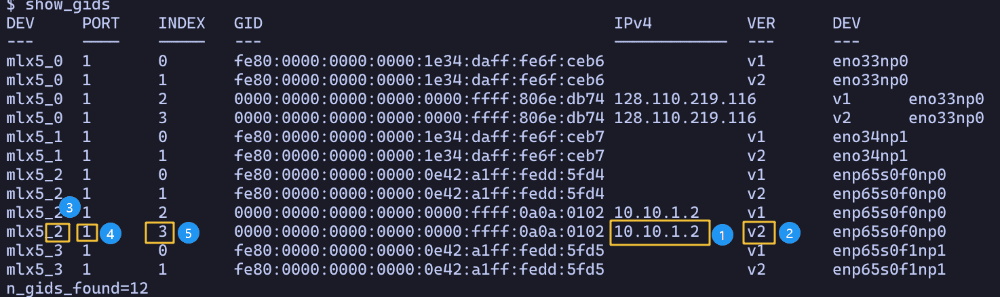

# RDMA lib


## build the library

```
meson setup build
ninja -C build/ -v
```

## integrate with other code base

This project will be compiled as a static library to be linked with other codes.

The static binary will be `libRDMA_lib.a` under the project directory after compilation.

### make


```
-L/path/to/this/repo -lRDMA_lib -libverbs
```

To use this library with a meson project, simply add `subdir('<path_to_this_lib>')` and then use the `libRDMA_lib_dep` in the dependencies of the compilation target.


Also add the `-I/path/to/RDMA_lib/include` to the cflags

### meson

Compile this code base to get the static library, then 

```
ibverbs_dep = dependency('libibverbs', required: true)
incdir = include_directories('RDMA_lib/include')
rdma_dep = declare_dependency(
  include_directories: incdir,
  link_args: ['-L' + root_dir + '/RDMA_lib', '-lRDMA_lib', ]
  )
```

Add the incdir to the include_directories of your target, then add the `rdma_dep` to the dependencies of your target.

Also this library requires the ibverbs library, so also add the `ibverbs_dep` to the dependencies of your target.


## determine RDMA specific settings

The `-d`, `-x` and `-i` setting specifies the RDMA device index, sgid index and ip port settings. These settings should be adjusted on a per node basis.

Please follow the following steps to determine these values.


1. determine a interface to use, note the interfaces on two nodes should in same IP sub network so they can talk to each other.

2. Choose the row with v2 instead of v1, which stands for RoCEv2 support.

3. determine the device index, which is number in yellow square labeled 3, and the full name of the device.

4. determine the ip port setting(`-i`), which is the number in the yellow sqare labeled 4.

5. determine the sgid index setting(`-x`), which is the number in the yellow sqare labeled 5.

For example, follow the setting in the picture, we should be using `python exp1.py --n_core 16 --n_qp 128 -x 3 -i 1 -d 2` on the server node and `python exp1.py --n_core 16 --n_qp 128 -x 3 -i 1 -d 2 --server_ip 10.10.1.1` on the client node.

## scripts

### `get_cloudlab_node_settings.py`

```bash
python3 ./scripts/get_cloudlab_node_settings.py
```
You will get the information needed for RDMA connection establishment, like device index, ib port number and gid index.

## examples

### `ping_pong`

The server will post a two side send request to client.
After receiving the request, client will post back a send request.

Compile the library with `make all`.

Change the `-d`, `-x`, `-i` of command line parameter according to the instruction from [determine RDMA specific settings](#determine-rdma-specific-settings).

`-d` is the device index, `-x` is the sgid index, `-i` is the ib port.
This example involves two nodes, one server and one client.

Assuming the picture bellow is from the client machine.
We can determine the RDMA specific settings accordingly.
The interface we are using is bound to IP `10.10.1.2`.

Assuming on the server machine, whose IP is `10.10.1.1`.
The client will use this IP (in its -H option) as the server destination.


```bash
# client side
./build/ping_pong -p 10001  -i 1 -x 3 -d 2 -L 10.10.1.1
# server side
./build/ping_pong -p 10001  -i 1 -x 3 -d 2 -H 10.10.1.1
```

The `-L` parameter is used by server to denote its port for RDMA request and also socket connection.
In our example it will be `10.10.1.1`

The `-p` is the port to be used to establish connection, which should be set to be the same on both server and client side.

### `ping_pong_cmplt_cnt` 

The functionalities and parameters are similar to `ping_pong binary`.
The only difference is the `ping_pong` use `ibv_poll_cq` to poll the completion queue.

The `ping_pong_cmplt_cnl` use completion channel and epoll.


Actually, they are interchangeable to each other. For example:

```bash
# server
./build/ping_pong_cmplt_cnl -p 10001  -i 1 -x 3 -d 2 -L 10.10.1.1
# client
./build/ping_pong -p 10001  -i 1 -x 3 -d 2 -H 10.10.1.1
```

### rdma-bench


The `-t` parameter denotes the type of primitive to use.


In the one side mode, the `-t` should be set to be 4.

`-n` is the number of message.

`-s` is the size of the msg.

`-H` paremeter denotes the address of the server.

`-d` is the rdma device index.

`-x` is the gid index

`-i` is the ib port

`-p` is the port

does not change `-c`, this parameter should be set to be 4 in this experiment.

#### two side mode

In the two side mode, the `-t` type parameter should be set to be 1.

```bash
# server
./build/rdma-bench -d 0 -x 3 -i 1 -p 8090 -t 4 -s 60000 -c 4 -n 100000
# client
./build/rdma-bench -d 0 -x 5 -i 1 -p 8090 -t 4 -s 60000 -c 4 -n 100000 -H 192.168.10.65
```

#### one side mode with coordination

```bash
# client
./build/rdma-bench -d 0 -x 5 -i 1 -p 8090 -t 4 -s 60000 -c 4 -n 100000 -H 192.168.10.65
# server
./build/rdma-bench -d 0 -x 5 -i 1 -p 8090 -t 4 -s 60000 -c 4 -n 100000

```

#### one side mode with copy

the copy mode requires to add `-y` at the client
and remember to set the `-t` to be 4

```bash
# client
./build/rdma-bench -d 0 -x 5 -i 1 -p 8090 -t 4 -s 60000 -c 4 -n 100000 -H 192.168.10.65 -y
# server
./build/rdma-bench -d 0 -x 5 -i 1 -p 8090 -t 4 -s 60000 -c 4 -n 100000 -y
```
